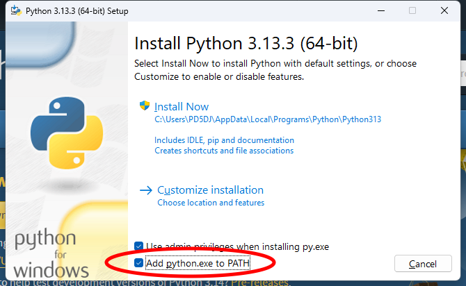
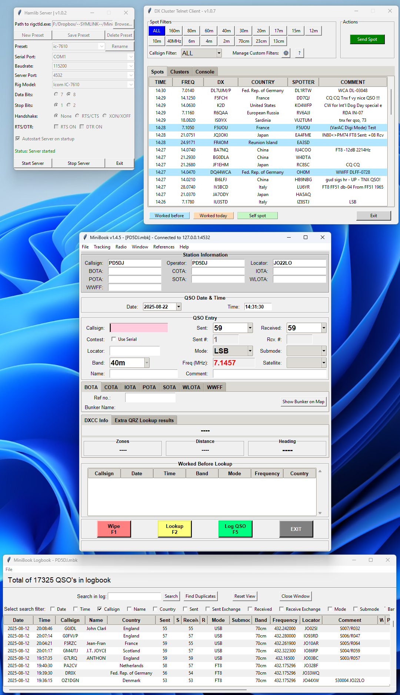

# MiniBook
Simple compact JSON based logbook with rig control

# The Story Behind MiniBook: A Compact Logbook Solution
MiniBook was created with a clear vision in mind: to provide radio enthusiasts with a compact, straightforward, and portable logbook solution. Unlike many of the heavier, installation-required programs on the market, MiniBook was designed to be lightweight and easy to use.

With MiniBook, logging a QSO is as simple as it gets, while still capturing all the critical information needed for accurate and complete records. The program includes a powerful ADIF import/export feature, allowing users to share and archive their logs in the widely recognized format.

For those who need to update or correct existing entries, the built-in QSO Editor makes adjustments fast and intuitive. Plus, for those transitioning from other systems, an external tool seamlessly converts existing ADIF logbooks into MiniBook’s dedicated .mbk format, making the switch easy.

Connecting it to almost any radio using Hamlib, MiniBook is able to track frequency and mode.
Furthermore MiniBook also accepts UDP QSO logging from other software like WSJT-X.

MiniBook stands out as a truly portable logbook, and packed with everything you need to log, edit, and convert with ease.

---
# Installation (Windows)

## You will need Python installed on your system.

You can download Python here: https://www.python.org/downloads/
When you start the setup it is very important that you click the following option **"Add Python.exe to PATH"**!

In the downloaded folder is the file **install_python_packages_Windows.bat**

Run this and all packages are installed.
You can then click on **MiniBook.py** and start it

This is my first serious Python project, developed with the help of ChatGPT.
If anyone is interested in contributing to the project, you're very welcome to join!

# MiniBook Logbook Application Manual

## 1. Introduction
The MiniBook Logbook Application is a user-friendly tool designed to manage your ham radio logbook. It allows you to store, view, and edit your QSO records with ease, while also offering features like file handling, station setup, and logbook management. This manual will guide you through the functions and features available within the program.

## 2. Key Features
- **QSO Management**: Add, edit, and delete QSO records.
- **Search Functionality**: Easily search for specific callsigns or other QSO details.
- **File Handling**: Load and save logbook files in JSON format (.mbk MiniBook files).
- **Station Setup**: Preset My Callsign, My Operator, My Locator, and My Location, My POTA and My WWFF References for each QSO.
- **QSO Viewing**: View, filter, and sort QSO records in a table format.
- **Logging**: Automatically logs your station setup details with each QSO.
- **Import / Export ADIF**: Use ADIF format for interoperability with other logging software and contest submissions.
- **Rig CAT Support**: Supports Hamlib, allowing direct or remote connection to your radio.
- **UDP QSO Log Support**: Receive QSO logs from other programs like WSJT-X.
- **QRZ Lookup Support**: You can now Lookup Callsigns with a QRZ Lookup subscription
- **QRZ Log upload Support**: You can now upload your logs woth a QRZ API Key
- **Limited Rig control!**: Entering frequency in KHz will set radio, also with modes: "USB,LSB,AM,FM,CW,RTTY"

## 3. User Interface Overview

### Main Window Menu
When you open the application, you’ll see the main window to interact with your logbook data.

#### Menu Bar

- **File**
  - **Load Logbook**: Load a MiniBook `.mbk` file.
  - **New Logbook**: Create a new MiniBook file.
- **Station Setup**
  - Set global parameters like My Callsign, My Operator, My Locator, and My Location, My POTA and My WWFF References. Also API Key for QRZ Upload can be entered here.
- **Preferences**
  - Enable Reload last used logbook upon start of MiniBook, (First open logbook before setting this!)
  - Set UTC Offset.
  - Setup Radio CAT control.
  - Setup UDP port QSO Logging (e.g., WSJT-X).
  - Setup QRZ Callsign Lookup Credentials.
- **Exit**: Exit MiniBook.

- **Tracking**
  - **Date/Time**: Enable or disable real-time clock updates.
  - **Radio Frequency & Mode**: Enable connection to radio or remote `rigctld`.

- **Window**
  - **Logbook**: Open the logbook viewer.

- **References**
  - Here you can find shortcuts to several websites when running POTA or WWFF
    
- **Help**
  - **Update DXCC Lookup File**: Will download the latest DXCC lookup file from github.
  - **About**: View application information.

### Main Window
Click “New QSO” to open a form and enter:
- Date
- Time
- Callsign
- Country
- Sent / Received Reports
- Mode / Submode
- Band / Frequency
- Locator
- Comment
- Heading (Calculated heading from QRZ Lookup Grid and/or Lattitude & Longitude)
- Satellite (Shows a list of current amateur satellites)
- WWFF (Enter a received WWFF reference number)
- POTA (Enter a received Parks On The Air reference number)

### QSO Edit Window
To edit a QSO, select the entry and click “Edit”. You can change any field, including:
- Date / Time
- Callsign / Country
- Sent / Received Reports
- Mode / Submode / Band / Frequency
- Locator / Comment
- WWFF / POTA
- My Callsign / My Operator / My Locator / My Location / My POTA / My WWFF
- Satellite

## 4. Station Setup

Set the following details to be automatically included in each QSO:
- **My Callsign**: Your active station callsign.
- **My Operator**: Enter the operators callsign when using different station callsign
- **My Locator**: Your Maidenhead grid locator (e.g., FN31pr).
- **My Location**: Your physical location (e.g., New York, USA).
- **My WWFF**: Your own WWFF reference number when activating FloraFauna
- **My POTA**: Your own Parks on the Air reference number when activating POTA
- **Upload to QRZ**
  - **QRZ API Key**
    - Enter your QRZ log upload API key, this key must match My Callsign!

## 5. Preferences
- **UTC Offset**
  - Go to `Preferences > UTC Offset` to configure local-to-UTC conversion.

- **Hamlib Rigctld Setup**
  - Connect MiniBook to your radio:
  - **Port**: Default is `4532`.
  - **Use External Server**: Enter remote IP for `rigctld`.

- **QSO Reception Using UDP (WSJT-X/JTDX/MSHV etc)**
  - Enable MiniBook to receive QSO logs:
  - **Port**: Set a port and match it in WSJT-X/JTDX.
- **QRZ Lookup Credentials**
  - Used to lookup Callsign information on QRZ Lookup, note!, you will need a QRZ subscription for this to work!
  - **Username**
  - **Password**

## 6. File Handling

### Loading a Logbook
Load a `.mbk` (JSON) file to:
- View data in tree format, sorted by date/time.
- Automatically apply saved station setup (Callsign, Locator, Location).

### Saving and Exporting
Save edited data back to `.mbk` format.

### Import from ADIF
- Click “Import ADIF” and choose file.
- The app checks for duplicates and lets you:
  - Ignore
  - Add
  - Overwrite

### Export to ADIF
- Use the export menu to save your logbook as an ADIF file.

### QSO Data Structure
Each QSO stores:
- Date / Time
- Callsign / Country
- Sent / Received Reports
- Mode / Band / Frequency / Submode
- Locator / Comment
- Station Info (My Callsign, Locator, Location)

### Automatic Updates
Station info updates automatically in new QSOs after any changes.

### DXCC Lookup
Uses [K0SWE’s DXCC JSON](https://github.com/k0swe/dxcc-json) for country and continent data based on callsign.

## 7. Managing QSOs

### Adding a QSO
- Click “New QSO” and fill out the form, then save.

### Editing a QSO
- Double-click a QSO in the viewer to edit.

### Deleting a QSO
- Select and click “Delete”; confirmation required.

### Search Functionality
- Enter callsign or keyword to filter QSO records.

### Sorting and Filtering
- Sort by any field.
- Filter by Callsign, Country, Mode, etc.

## 8. Troubleshooting

### Program Errors
- Ensure `.mbk` or JSON files are correctly formatted.

### Missing QSO Entries
- Check that required fields (Date, Time, Callsign) exist.

### Date/Time Errors
- Format should be `YYYY-MM-DD` and `HH:MM`.

### Bugs or Issues
- Contact the developer if you experience issues.

## 9. Conclusion
The MiniBook Logbook Application helps streamline logging, editing, and managing your ham radio QSOs. With features like station setup, ADIF import/export, and CAT/UDP support, it’s a powerful tool for any amateur radio operator.

---

# 1. Downloading MiniBook

As of now, MiniBook is only available as a Python script due to security concerns related to compiling it into an executable file.

## Access the Project

MiniBook is hosted on GitHub. You can download or clone the project from the following link:

🔗 https://github.com/PD5DJ/MiniBook

## Download Instructions

- Open the GitHub project link above.
- Click the green “Code” button, then select “Download ZIP” to download the project as a ZIP file, or choose “Clone” to use Git.

# 2. Running and Using MiniBook

Since MiniBook is now a Python script, it requires Python to run.

## Steps to Run

### Install Python (if you haven’t already)

Download the latest version from https://www.python.org/downloads/

### Download MiniBook from the GitHub link above

### Extract the ZIP file (if you downloaded it as a ZIP)

### Install Required Libraries

Before running the program, you need to install the necessary Python libraries.  
Open a terminal or command prompt, navigate to the extracted MiniBook folder, and run:

pip install -r requirements.txt

or run:

install_libraries.bat

### Run the Program

Once the dependencies are installed, start MiniBook by running:

python minibook.py

Make sure you’re running this in the same directory where minibook.py and requirements.txt are located.

# 3. File Handling and Storage

**MiniBook Content**: MiniBook stores logbook data in JSON format, using the .mbk file extension. You can load and save your QSO entries through the app.

**Version Control**: Always check the GitHub repository for the latest updates and features.

# 4. Getting Support

If you encounter any issues or need help using MiniBook, feel free to open an issue on the GitHub repository or reach out using the contact information provided there.
